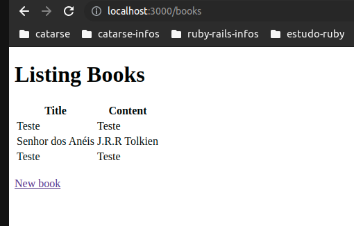
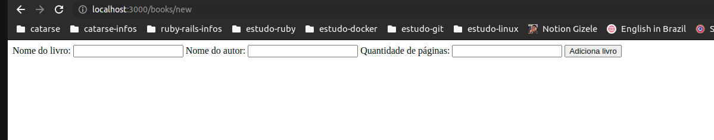
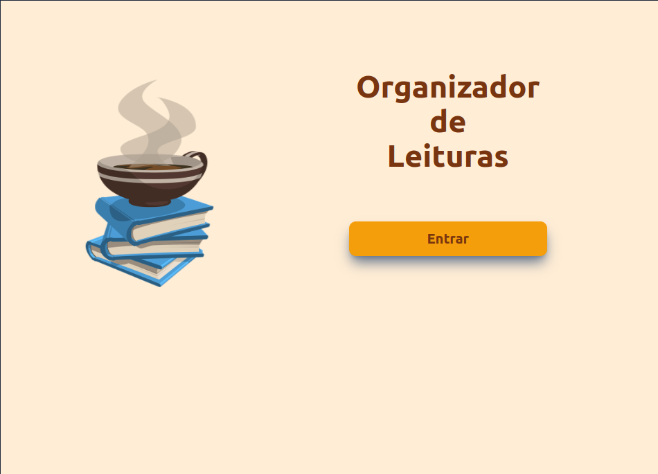
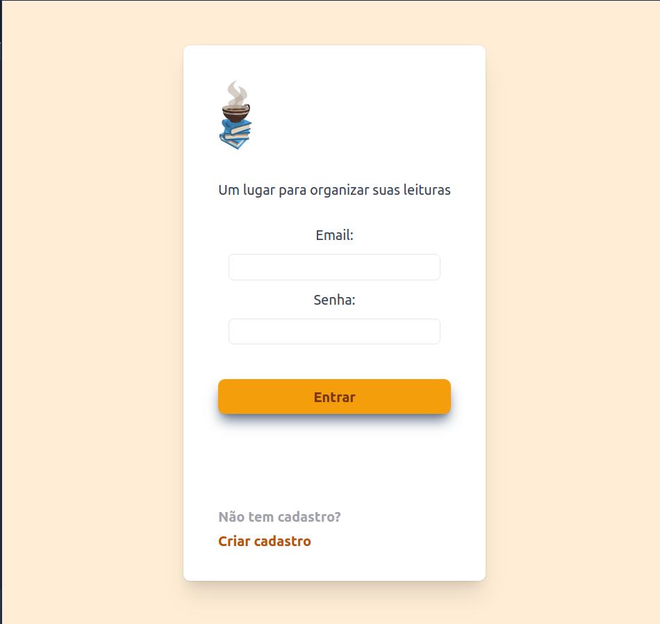
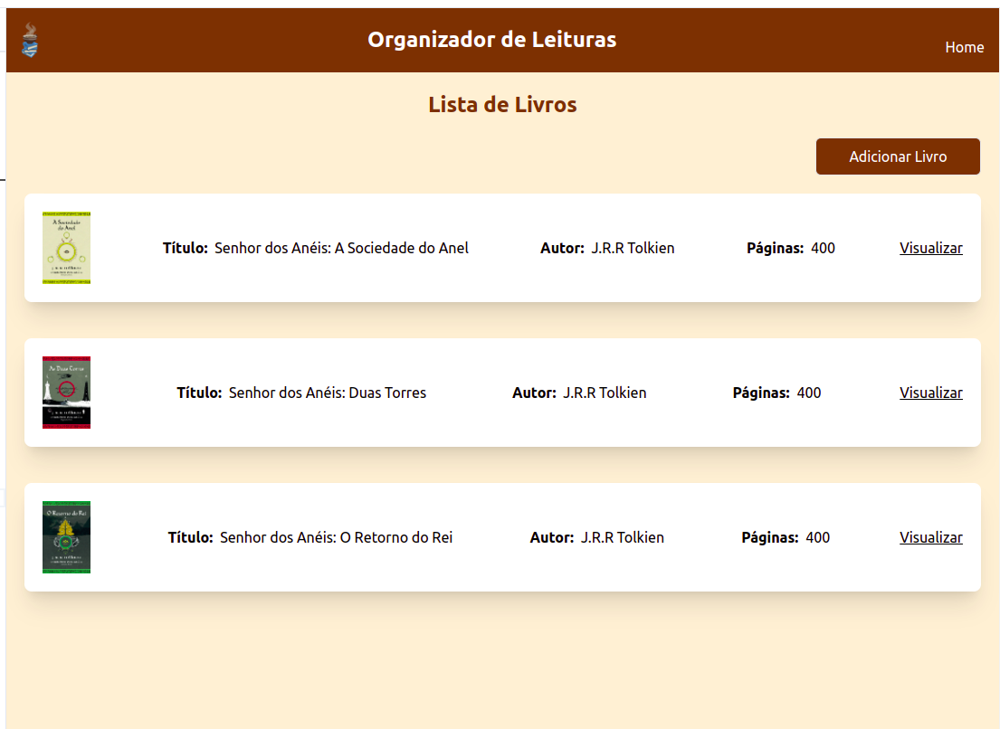

# README

### Projeto Leituras

Objetivo: A ideia desse projeto é construir um sistema para organização de Leituras

___
### Etapa 1:
Cadastro de Livros simples: *Nome*, *autor* e *quantidade de páginas*
Tela básica padrão Rails com formulário contendo esses 3 campos.

**Resultado inicial:**

  1. Página de Listagem dos Livros:

  

  2. Página de Criação do Livro:

  

___
### Etapa 2:
Estudo das Páginas com Tailwind.

**Resultado inicial:**

  1. Página Inicial:

  [Página Inicial](https://play.tailwindcss.com/w4ZhfAZFoP)
  

  2. Página de Login:

  [Página Login](https://play.tailwindcss.com/MMwQGl7zY5)
  

  3. Página de Listagem:

  [Página Listagem](https://play.tailwindcss.com/D9GU9GhrLd)
  

  3. Página do Livro:

  [Página do Livro](https://play.tailwindcss.com/3WFYKMOTPq)
  
