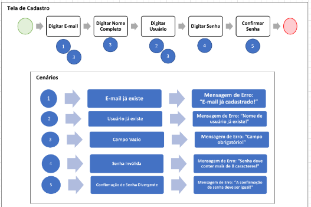

# README

### Projeto Leituras

Objetivo: A ideia desse projeto é construir um sistema para organização de Leituras

___

### Arquitetura de Testes do Projeto
A ideia é seguir nos seguintes testes:
  1. Rotas - teste simples só para checar as rotas criadas no sistema

     [Exemplo teste de rotas](https://dev.to/xandekk/testando-routes-em-rspec-rails-cbj)

  2. Modelos - teste com validações e outros detalhes presentes nos modelos

     [Exemplo teste de modelo](https://semaphoreci.com/community/tutorials/how-to-test-rails-models-with-rspec)

  3. Sistema - teste que verifica a experiência do usuário

     [Exemplo teste de sistema](https://rubyyagi.com/intro-rspec-capybara-testing/)

  4. Componentes - teste renderização e especificações do componentes

  [DOC Rspec](https://rspec.info/documentation/3.6/rspec-expectations/RSpec.html)


Ideia de como Realizar os teste:

* Escrever o passo a passo do teste
* E os cenários importantes de serem cobertos
* Conforme exemplo abaixo:




____

### Etapa 1:
Cadastro de Livros simples: *Nome*, *autor* e *quantidade de páginas*
Tela básica padrão Rails com formulário contendo esses 3 campos.

**Resultado inicial:**

  1. Página de Listagem dos Livros:

  

  2. Página de Criação do Livro:

  

___
### Etapa 2:
Estudo das Páginas com Tailwind.

**Resultado inicial:**

  1. Página Inicial:

  [Página Inicial](https://play.tailwindcss.com/w4ZhfAZFoP)

  2. Página de Login:

  [Página Login](https://play.tailwindcss.com/MMwQGl7zY5)

  3. Página de Listagem:

  [Página Listagem](https://play.tailwindcss.com/D9GU9GhrLd)

  4. Página do Livro:

  [Página do Livro](https://play.tailwindcss.com/3WFYKMOTPq)

  5. Página Criação do Livro:

  [Página Criação do Livro](https://play.tailwindcss.com/tKfmkQt5R9)

___
### Etapa 3:
1. Configuração do Tailwind.

[Adicionando Tailwind em um projeto com Rails 7](https://dev.to/dnovais/adicionando-tailwind-em-um-projeto-com-rails-7-1hjo)

```ruby
bundle add tailwindcss-rails

rails tailwindcss:install
```

2. Alteração do Layout da Página de Listagem do Livro

3. Alteração do Layout da Página de Criação do Livro
